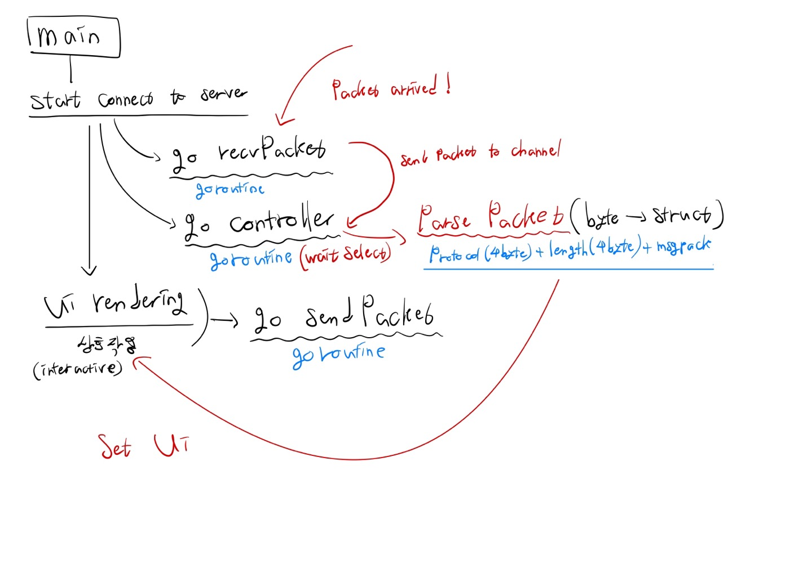
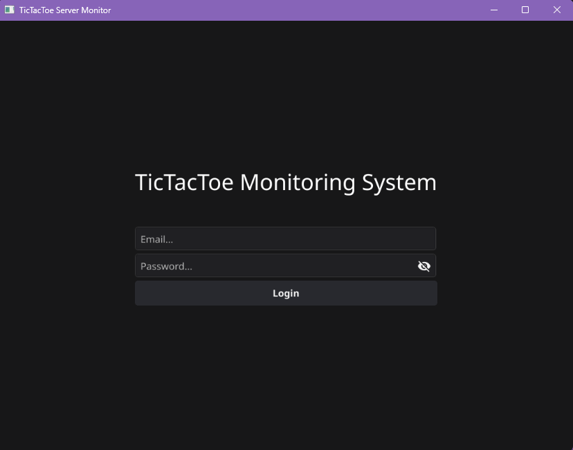
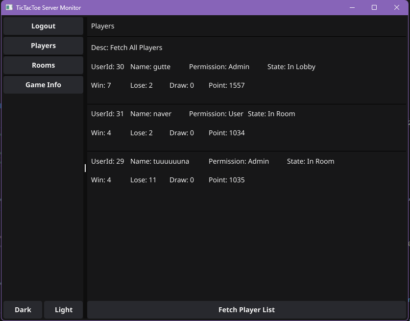
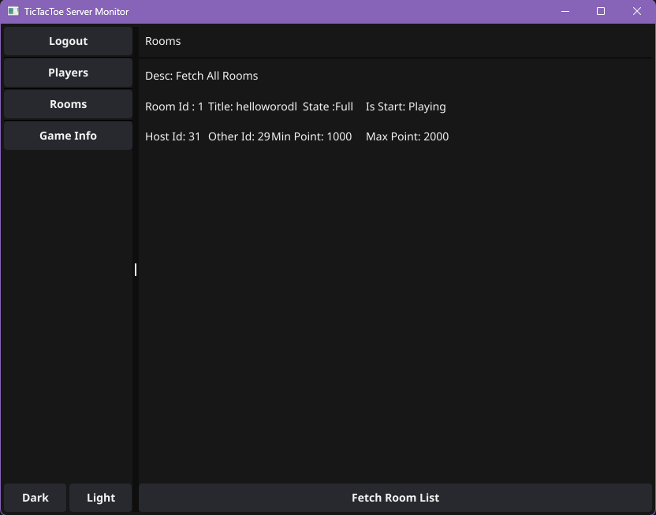
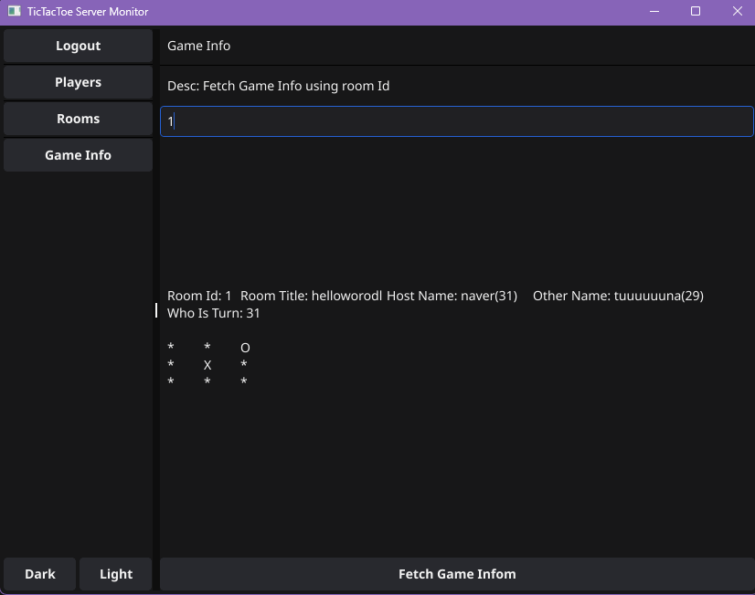

# TicTacToe Server Monitoring GUI Program 
틱택토 서버를 모니터링하기 위해 go로 만든 GUI 프로그램입니다.   
GUI 라이브러리로는 fyne v2를 사용함.  

주 기능   
- 플레이어 목록 가져오기 
- 방 목록 가져오기 
- 게임아이디를 통해서 실시간 게임 정보 받아오기 

# Architecture 

# Imges 
### Login

### Fetch Players

### Fetch Rooms

### Fetch Game Info
